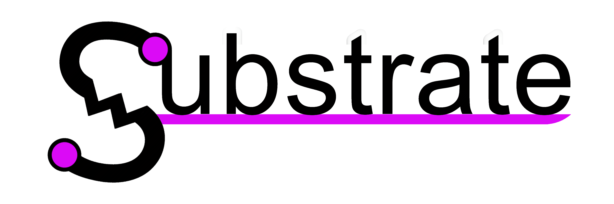

- [Build Instructions](#build-instructions)
  - [Build Setup](#build-setup)
  - [Packaging a Build for Release](#packaging-a-build-for-release)
  - [Build/Packaging Dependencies](#buildpackaging-dependencies)
- [Development](#development)
  - [Binary Crates](#binary-crates)
  - [Core Wrapper Crates](#core-wrapper-crates)
  - [Non-Core Library Crates](#non-core-library-crates)
  - [Versioning](#versioning)

## Build Instructions

### Build Setup

1. Ensure you have an up to date version of the Rust toolchain installed (run
   `rustup update`). The project may build on older Rust tooling, but only the
   latest stable versions are guaranteed.
2. Ensure you have Python 3.9 or newer.
3. The build scripts will walk you through installing the build-dependencies you
   need, but installing
   [your platform's necessary dependencies](#buildpackaging-dependencies) ahead
   of time may speed up the process (especially on MacOS where some of the
   dependencies can take a *very long time* to install).
4. Run [build_setup.py](./build_setup.py). This will walk you through any steps
   you need to take before you can build. Run this script until it says you're
   all set (you may need to run it multiple times if you're missing
   dependencies).

```sh
python3 ./build_setup.py --help
```

### Packaging a Build for Release

To package the app into a self-contained directory/archive, run
[build_package.py](./build_package.py). This script will build everything for
your platform and move it to a self-contained directory/archive (`./package/` by
default).

```sh
python3 ./build_package.py --help
```


### Build/Packaging Dependencies

The table below lists the dependencies needed to run the
[build_setup.py](./build_setup.py) and [build_package.py](./build_package.py)
scripts for each platform. The build scripts will walk you through installing
any dependencies you don't have. The table is just for reference.

<table>
<tr><th>Platform</th><th>Details</th></tr>
</tr><td><b>Windows</b></td><td>

Windows 10 (x86_64) and Windows 11 (x86_64) are supported. Native Arm64 support
for Windows is not currently planned.

For building ([build_setup.py](./build_setup.py)):

- Ensure you're using the `x86_64-pc-windows-msvc` toolchain for Rust (default).
- Ensure you have the
  [Visual Studio Installer](https://visualstudio.microsoft.com/downloads/) (2022
  or 2026, *Community* is fine).
- The [7z command-line utility](https://www.7-zip.org/download.html) is
  optional but recommended. Without it the script will always require human
  input (even if you have the above dependencies and provide the `-y` flag).

For packaging ([build_package.py](./build_package.py)):

- [Inno Setup](https://jrsoftware.org/isinfo.php) is required if you want to
  package the app with an installer. You can skip this dependency (meaning
  you'll create a package with no installer) by providing the `--no-installer`
  flag.

</td></tr>
<tr><td><b>MacOS</b></td><td>

Both x86_64 and Arm64 (Apple silicon, e.g. M1) platforms are natively supported
for MacOS.

For building ([build_setup.py](./build_setup.py)):

- You'll need the `ffmpeg@8` and `pkg-config` packages installed globally
  through the [Homebrew](https://brew.sh/) package manager. Note that installing
  these can sometimes take an *exremely* long time.

For packaging ([build_package.py](./build_package.py)):

- You'll need Xcode's Command Line Tools. You can install these by running
  `xcode-select --install`.

</td></tr>

</td></tr>
<tr><td><b>Linux</b></td><td>

Linux is not officially supported just yet.

</td></tr>
</table>

Cross-compilation support is not currently planned. Builds should only be
expected to work on other systems with the same kind of OS (Windows, MacOS,
Linux) and the same architecture (x86_64, Arm64).

## Development

### Binary Crates

There are 2 binary crates. `launcher` acts mainly as a project selector for
starting up editor instances. `editor` is an actual project editor.

Run a binary like this:

```sh
cargo run -p <BINARY_NAME> -- [ARGUMENTS_FOR_BINARY*]
```

Note that when the `launcher` binary goes to spawn an `editor` binary it will
not automatically be an up-to-date build of the editor. Make sure to always
manually build the `editor` crate before spawning an editor from the `launcher`.
To build an up-to-date `editor` and run an up-to-date `launcher` run the
following command:

```sh
cargo build -p editor && cargo run -p launcher
```

Both binaries have arguments that you may find useful. Run them with the
`--help` flags for more info.

```sh
cargo run -p <BINARY_NAME> -- --help
```

### Core Wrapper Crates

The `editor` and `launcher` binary crates are really just wrappers around the
`editor-core` and `launcher-core` library crates (or the `app-core` crate when
the `link-dylib` feature is enabled).

This is done to enable the `link-dylib` feature for the `editor` and `launcher`
binary crates. When this feature is enabled (and the `link-static` feature is
disabled), the binaries will expect to be able to link to a dynamic library
called `app_core_dylib` (e.g. `app_core_dylib.dll` on Windows,
`app_core_dylib.dylib` on Unix). This dynamic library re-exports the same
things `editor-core` and `launcher-core` export, just through a C-ABI. Building
the `app-core-dylib` crate will create this shared library.

Doing dynamic linking like this move's all of the app's code into the shared
library, leaving the binaries as just thin wrappers. This makes it more
reasonable to ship many different binaries since each one doesn't need to come
with everything statically linked (making file sizes huge). This is great for
Windows where we currently ship 4 different executables (a console and
no-console variation of both binaries).

To reduce compilation times, dynamic linking is not enabled by default.

### Non-Core Library Crates

- The `engine` crate is a library for handling node graphs and rendering.
- The `media` crate is a library for handling media data (images, video, MIDI).
- The `util` crate is a library of common useful utilities that can be used
  across any of the other crates. Each utility is gated behind a feature.

### Versioning

The app's version is set by the `workspace.package.version` field in the root
[Cargo.toml](./Cargo.toml) file. This is the single source of truth for the
entire project (the app's version shouldn't be hard-coded anywhere else).
